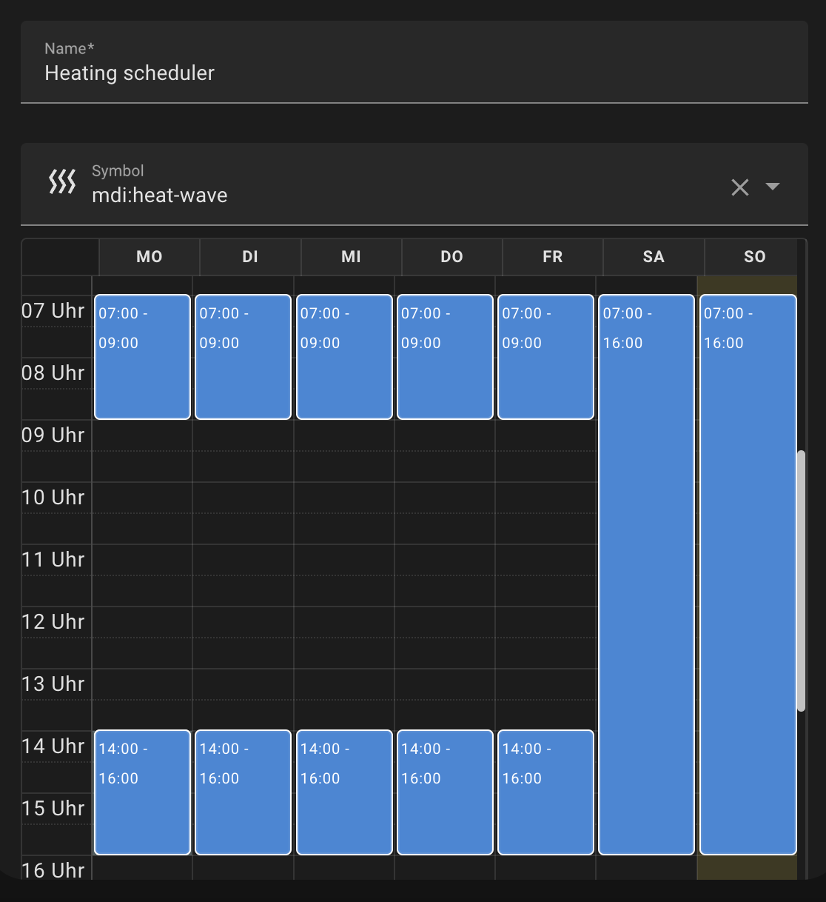
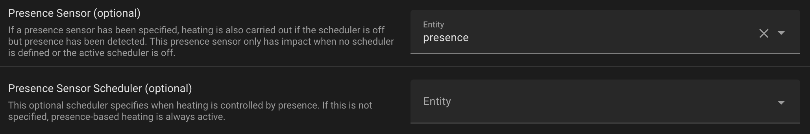
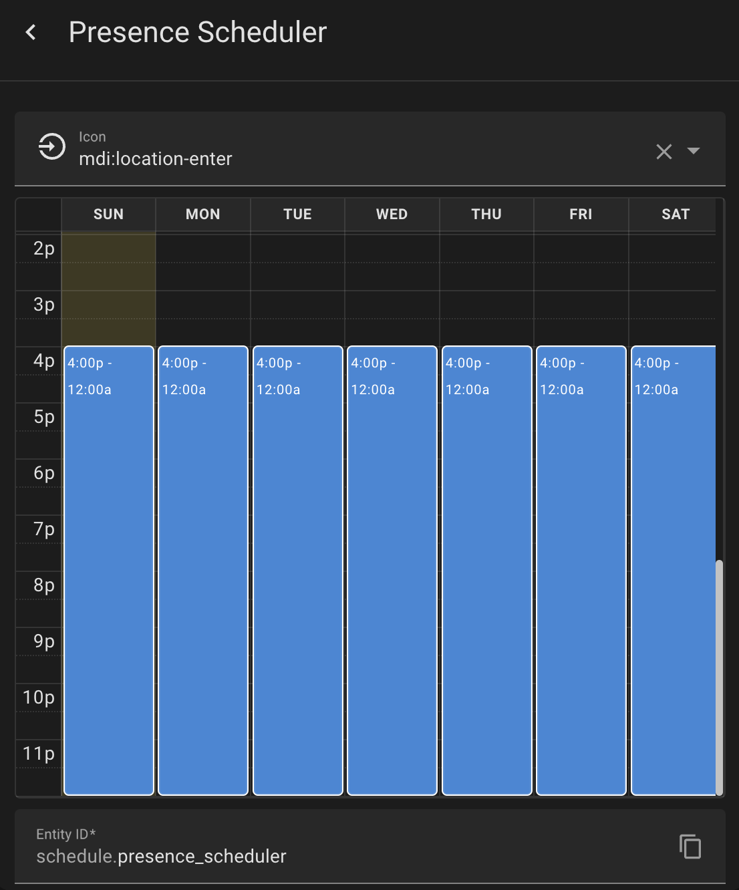
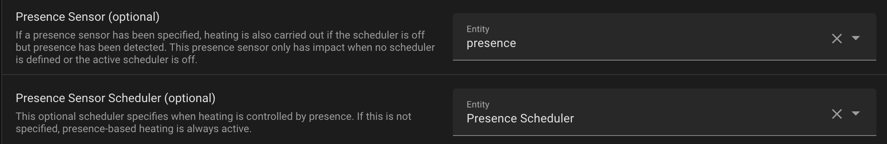

# :fire: **ADVANCED HEATING CONTROL v3** :fire:

## Base configuration

For a minimal configuration setup your valves and your prefered temperature. That means the *comfort temperature* and the *minimum temperature*.

The *comfort temperature* will be set if the conditions you can setup match. Otherwise the *minimum temperature* will be set.

>**Note**: with this configuration heating is not possible. It's just a base setup. 
For some features you need to provide a comfort temoperature *input_number* entity. Also if you want to change it in your front end.

## Heating Possibilites

Now you are ready to go to setup your entities that make use of your base setup. 
There are three different approaches to setup your intelligent heating plan and all can be combined together to make it flexible like you want.

### 1. Heating based on persons who are at home

You can configure your heating automation simply by persons who are at home. If you use the companion app it's easy to track this or just map a networkdevice to a certain person. 
So just define at least one person for the automation. This should be the person who's living in the room. 

Now your automation works person based. If the person is home *comfort temperature* will be set.

### 2. Scheduler based heating

You can define schedulers in home assistants helper section. 

The schedulers works like plans for your heating. 

You also can setup a 2nd scheduler for holidays which can be switched by an *input_boolean* or a boolean sensor.

#### 2.1 Fully time/scheduler based
If you want to use it fully timebased. Leave the person section empty.

#### 2.2 Scheduler combined with persons
Setup some persons. So now *comfort temoerature* will be set if the scheduler is *on* and somebody is home. 
Let's say you heat the during the day and leave your home heating will be set to *minimum temperature*.

### 3. Presence based heating

You can setup a *presence detector*. Which means *presence detected* then *heat* to *comfort temperature*.

#### 3.1 Fully presence based
If you leave persons and the schedulers empty the automation works fully presence based. 
If presence is detected the *comfort temperature* will be set.

#### 3.2 Presence combined with persons
There is an option to couple it with persons. So the presence detection is just enabled if somebody is home. 
If you want you can also define time windows where presence detection shall be active. For that purpose you can define another scheduler for presence detection.

# Combination Overview

|                   | Person                                                                                                               | Heating Scheduler1                                                                                           | Presence Sensor2                                                                                                     |
|-------------------|----------------------------------------------------------------------------------------------------------------------|-------------------------------------------------------------------------------------------------------------|----------------------------------------------------------------------------------------------------------------------|
| **Person**            | :fire: somebody is home  :snowflake: nobody is home                                                              | :fire: scheduler is on **and** somebody is home  :snowflake: scheduler is off **or** nobody is home     | :fire: somebody is home **and** presence is detected  :snowflake: nobody is home **or** no presence is detected  |
| **Heating Scheduler1** | :fire: scheduler is on **and** somebody is home   :snowflake: scheduler is off **or** nobody is home             | :fire: scheduler is on   :snowflake: scheduler is off                                                   | :fire: scheduler is on **or** presence is detected  :snowflake: scheduler is off **and** no presence is detected |
| **Presence Sensor2**   | :fire: presence is detected **and** somebody is home  :snowflake: no presence is detected **or** nobody is home  | :fire: scheduler is on **or** presence is detected  :snowflake: scheduler is off **and** nobody is home | :fire: presence is detected  :snowflake: no presence is detected                                                 |

> **1**: You can choose between two heating schedulers a main one and a *holiday scheduler*. You can switch between them by providing your *holiday sensor / toggle*.

> **2**: You can set time windows when presence detection shall be enabled by providing a *presence detection scheduler*.

# Example Configuration
Let's say I am the only one who's living in a specific room. So I setup the automation and define me as person. 

I want the room to be heated in the morning and afternoon and the hole day on weekend. Let's define a scheduler for that room.

Now my automation set the thermostats to *comfort temperature* if the scheduler is *on* and I am *home*. Nice! 
 
But wait: Heating is only configured till 16.00 o'clock. There are some days I stay awake and do some work or watching TV but I don't want to heat stupidly to 24:00 o'lock. 
Let's add a presence sensor for this case. I know, if I am in that room I always have my lights on in the evening. So I take my grouped lights or at least one light and create an fake presence sensor, a template based senso in the helper section. 

Lets put this sensor to my configuration.

Now I want the presence sensor only get in the game after 16:00 o'clock. 
I need another scheduler to define the time window when the presence detection shall be avtive.

Let's put the scheduler to our configuration.

This configuration makes heating up the room from 7.00 - 16.00 o'clock if I am home. And after 16.00 o'clock if I am in the room based on presence. If I turn off my lights heating will also turned down.