# Rounded

This templates and theme is inspired by [rounded](https://community.home-assistant.io/t/rounded-dashboard-guide) by LE0N.


- [Requirements](#requirements)
- [Installation](#installation)
  - [Card installation](#card-installation)
  - [Language support](#language-support)
  - [Theme](#theme)
- [Cards](#cards)
  - [Alarm](#alarm)
  - [Base](#base)
  - [Calendar](#calendar)
  - [Input Number](#input-number)
  - [Light](#light)
  - [Dimmable Light](#dimmable-light)
  - [Person](#person)
  - [Radial info](#radial-info)
  - [Room](#room)
  - [Scene](#scene)
  - [Script](#script)
  - [Sensor](#sensor)
  - [Titel](#titel)
  - [Titel badge](#titel-badge)
  - [Pill](#pill)
  - [Weather pill](#weather-pill)
- [Modifiers](#modifieres)
  - [Variables](#variables)
  - [Extra Information](#extra-information)
  - [Background Color](#background-color)
- [Tips](#tips)
  - [Center pills](#center-pills)

## Requirements

You need some custom cards. Best way to install them is using [HACS](https://hacs.xyz/).

- [button card](https://github.com/custom-cards/button-card)
- [card mod](https://github.com/thomasloven/lovelace-card-mod)
- [my cards bundle](https://github.com/AnthonMS/my-cards)
- [atomic calendar](https://github.com/totaldebug/atomic-calendar-revive)
- [apex chart card](https://github.com/RomRider/apexcharts-card)
- [mini graph card](https://github.com/kalkih/mini-graph-card)

## Installation

## Card installation
1. Put the *template* directory anywhere in you *config* directory, e.g. */config/ui/templates*
```
├── config
| ├── ui
| | ├── templates
```

2. open your *ui-lovelace.yaml* and add following line at the top:

```yaml
button_card_templates: !include_dir_merge_named "ui/templates"
```

## Language support
You can find language files here:
 ```
├── templates
| ├── base
| | ├── languages
```

If you want to add a new one, just doublicate a existing language file and rename it. Open it and change the upper name, e.G. *de-DE*
Edit the state values to your needs. When you're ready open the *state_engine.yaml* and replace the language template with yours:

```yaml
state_engine:
  template:
  - de-de
```
### Adding more translations
You can add more translations to your language file. Be sure to add the variables to the language dictionary in your *state_engine.yaml*:

```yaml
var lang = {
  "on": variables.lang_on,
  "off": variables.lang_off,
  "not_home": variables.lang_not_home,
  "home": variables.lang_home,
  "paused": variables.lang_paused,
  "playing": variables.lang_playing,
  "stopped": variables.lang_stopped,
  "heat": variables.lang_heat,
  "night": variables.lang_armed_night,
  "armed_custom_bypass": variables.lang_armed_custom_bypass,
  "arming": variables.lang_arming,
  "armed_away": variables.lang_armed_away,
  "disarmed": variables.lang_disarmed
};
```

## Theme
1. Download the theme and put it in cour config directory:

```
├── config
| ├── themes
| | ├── rounded
| | | ├── rounded.yaml
```

2. go to *developer tools > services* and call 
```yaml
service: frontend.reload_themes
```

3. You can set it to default by calling:

```yaml
service: frontend.set_theme
data:
  name: Rounded
```
4. Go to your profile settings and select the theme *rounded*

## Cards

### Alarm
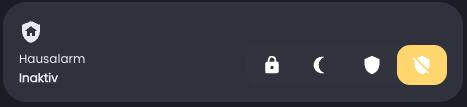

```yaml
type: 'custom:button-card'
entity: alarm_control_panel.alarmo
template: alarm
name: Hausalarm
```

### Base
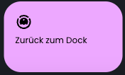

```yaml
type: 'custom:button-card'
template: base
entity: some.entity
variables:
  extra_entity
```

### Calendar


```yaml
type: 'custom:button-card'
entity: calendar.familie
template: calendar
```

### Caption


```yaml
type: 'custom:button-card'
template: caption
show_label: false
name: Wohnzimmer
```

### Graph
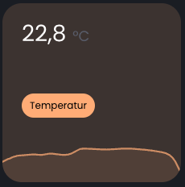

```yaml
type: sensor
entity: sensor.schlafzimmer_luftfeuchtigkeit
name: Luftfeuchtigkeit
hours_to_show: 24
detail: 1
graph: line
icon: none
card_mod:
  class: graph
  style: |
    ha-card { 
      --graph-color: var(--blue);
      --graph-background-color: var(--blue-tint);
    } 
```

### Mini Graph
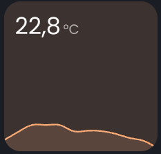

```yaml
type: custom:mini-graph-card
card_mod:
  style: |
    ha-card {
      background-color: var(--orange-tint) !important;
    }
    ha-card .graph {
      background: transparent !important;
    }
line_color: "var(--orange)"
show:
  icon: false
  name: false
  state: true
  legend: false
  fill: true
  labels: false
  points: false
  graph: line
entities:
          - sensor.wohnzimmer_temperatur
```

### Input Number
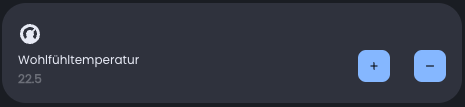

```yaml
type: 'custom:button-card'
template: input_number
entity: input_number.erdgeschoss_wohlfuehltemperatur
```

### Light
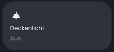

```yaml
type: 'custom:button-card'
template: button_light
entity: light.kueche_deckenlicht
```

### Dimmable Light
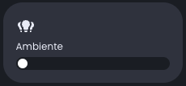

```yaml
type: 'custom:button-card'
template: button_light_slider
entity: light.kueche_deckenlicht
```

### Media
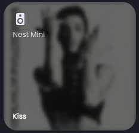

```yaml
type: custom:button-card
template: media_player
entity: media_player.fernseher
variables:
  max_height: true #see modifiers for more info
```

### Person
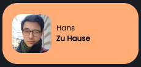

```yaml
type: 'custom:button-card'
template: person
entity: person.hans
```

### Radial Info
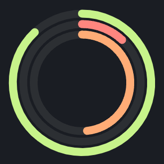

```yaml
type: custom:apexcharts-card
chart_type: radialBar
style: |
  ha-card {
    border-radius: "var(--border-radius)";
    box-shadow: none;
    padding-bottom: 0px;
    padding-top: 0px;
    background-color: transparent;
  }
header: 
  show: false
apex_config: 
  title:
    floating: false
    align: top
    style: 
      fontSize: 2px
      fontWeight: bold
  chart: 
    fontFamily: Poppins
    foreColor: rgb(148,148,148)
    offsetY: 5
  legend: 
    show: false 
series:
  - entity: sensor.disk_use_percent
    name: SSD
    color: var(--green)
  - entity: sensor.processor_use
    name: CPU
    color: var(--red)
  - entity: sensor.memory_use_percent
    name: RAM
    color: var(--orange)
```

### Room
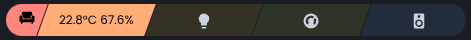

```yaml
type: 'custom:button-card'
template: room
variables:
  icon: mdi:sofa-single
  # entity_1_icon: mdi:thermometer
  entity_1_value: "[[[ return states['sensor.wohnzimmer_temperatur'].state+'°C ' + states['sensor.wohnzimmer_luftfeuchtigkeit'].state + '%'; ]]]"
  entity_1_on: true
  entity_2_icon: mdi:lightbulb
  entity_2_on: "[[[ return states['light.wohnzimmer_kuechenlichter'].state == 'on'; ]]]"
  entity_3_icon: mdi:thermostat
  entity_3_on: "[[[ return states['climate.wohnzimmer_thermostat'].state == 'heat'; ]]]"
  entity_4_icon: mdi:speaker
  entity_4_on: "[[[ return states['media_player.fernseher'].state != 'off' || states['media_player.nestmini_kueche'].state == 'playing'; ]]]"
```

### Scene


```yaml
type: 'custom:button-card'
template: scene
variables:
  color: orange
  scene: scene.muggelmodus
```

### Script
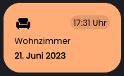

```yaml
type: 'custom:button-card'
name: Terasseneingang
template: button_script
entity: script.reiner_reinigung_terasseneingang
```

### Sensor
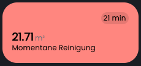

```yaml
type: 'custom:button-card'
name: Terasseneingang
template: sensor
entity: sensor.test
```

### Titel


```yaml
type: 'custom:button-card'
template: title_card
name: Erdgeschoss
label: Lichter & Geräte # optional
```

### Titel badge


```yaml
type: 'custom:button-card'
template: title_card_badge
name: Esszimmer
entity: sensor.esszimmer_temperatur
variables:
  badge_name: "[[[ return states['sensor.esszimmer_temperatur'].state + ' °C'; ]]]"
  badge_label: "[[[ return states['sensor.esszimmer_luftfeuchtigkeit'].state + '%'; ]]]"
```

### Pill


```yaml
type: 'custom:button-card'
template: pill
show_icon: true
icon: mdi:sofa-single
entity: sensor.wohnzimmer_temperatur
name: "[[[ return states['sensor.wohnzimmer_temperatur'].state + ' °C'; ]]]" # If you don't define name and label, the state of the entity including its unit will be shown.
label: "[[[ return states['sensor.wohnzimmer_luftfeuchtigkeit'].state + '%'; ]]]"
```

### Weather Pill
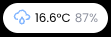

```yaml
type: 'custom:button-card'
template: weather_pill
entity: weather.dwd_weather_schwerin
```

## Modifieres 

### Variables
Here are some varaibles to modify the shown values:

```yaml
variables:
  round: 2 # round state value if it's nummeric
  multiplier: 1 # multiply state if its nummeric
  show_last_changed: false # show last_changes instead of state
  force_date: false # activate this if state is a date but treaten like an string
  show_unit: false # show / hide unit
  max_height: false # maximize height if needed
  on_state: heat # define a state, except on whicht activates activation color for your card
  active_color: #if your entity is on or the state matches the on_state this background color will be set
```

### Extra Information
You can add additional info to any card except *pills*, *captions* and *titles*:

```yaml
type: 'custom:button-card'
name: Name
template: base
entity: sensor.test
custom_fields:
  es: Extra Information #here you can add extra information. it will be displayed in the upper right corner
```

### Background Color

If you want some color for your cards, add the background color template. You can define a background color variable in order to set a color. Leave it for a random color.

```yaml
type: 'custom:button-card'
name: Name
template: 
- sensor
- background_color
variabels:
  background_color: red # delete this for a random color
entity: sensor.test
```

## Tips

### Center Pills

```yaml
type: horizontal-stack
cards:
- type: 'custom:button-card' #put this at start and end to center the cards between
  color_type: blank-card
  
- type: 'custom:button-card'
  template: 
  - pill
  - background_color
  variables:
    background_color: green
  icon: mdi:harddisk
  show_icon: true
  entity: sensor.disk_use_percent
  label: "%"

- type: 'custom:button-card'
  color_type: blank-card
```
